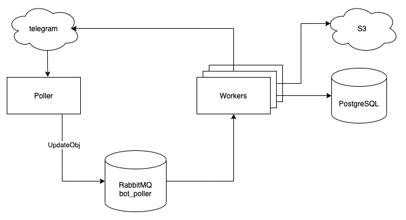

<h1 align="center">Загрузка сообщений, фото, видео и документов в базу данных Postgresql и s3 хранилище MINIO.
</h1>

<h1>Архитектура</h1>

    

        

            

Бот состоит из трех основных частей:
>poller (поллер)
> 
>queue (очередь)
> 
>worker (воркеры)

>Poller.
>>Внутри работает фоновая корутина, которая получает данные из Телеграма методом getUpdates. Когда новые данные появились, poller должен положить их в очередь.
poller реализован один для того, чтобы при параллельном вызове getUpdates, новые события от бота не были потеряны.
poller не выполняет бизнес-логику, он получает события из Телеграма и кладет объект в очередь.
> 
>Queue
>>Для данной работы использовался брокер сообщений RabbitMQ.
> 
>Worker. 
>>Запускает внутри несколько корутин, которые будут получать сообщения из queue и выполнять бизнес-логику. Количество корутин определяется в параметрах воркера.
Такая архитектура позволяет масштабировать производительность, потому что мы можем гибко добавить количество воркеров в случае большой нагрузки.

>Запуск приложения:
>>Запустить в терминале команду docker-compose up;
>>>Перейдите по адресу: http://127.0.0.1:9001/buckets и создать ведро "tests", логин и пароль minioadmin
>>>>Установить зависимости запустив команду в терминале pip install -r rquirements.txt
>>>>>Запустить два файла app_Poller/Poller.py и app_Worcker/Worcker.py
>>>>>>Перейти по ссылке https://t.me/test_kts_bot к боту и отправить текст, фото или документ, через некоторое время 
> данные появятся в s3 хранилище.